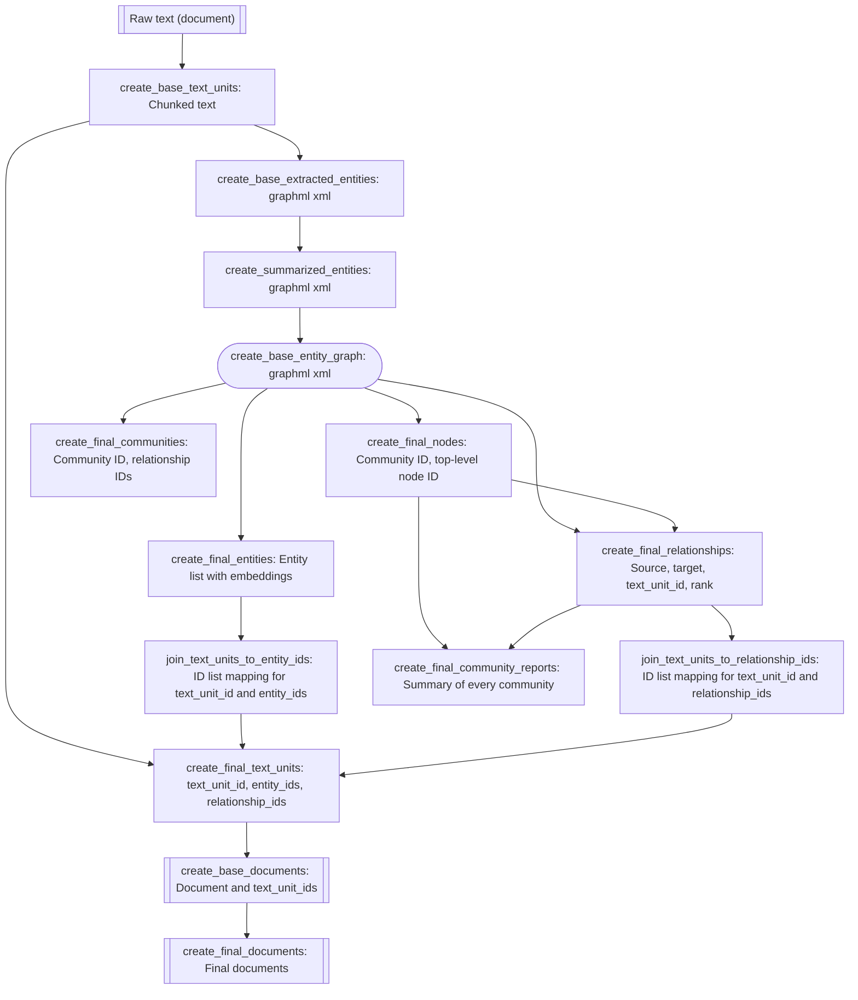

# 🤖GraphRAG lab with Azure OpenAI🥦 

## GraphRAG Official Repository and Third-Party Implementations

   - [Get Started](https://microsoft.github.io/graphrag/posts/get_started/)  
      - [GraphRAG Accelerator](https://github.com/azure-samples/graphrag-accelerator)
      - [Visualizing Relationships with NetworkX](https://github.com/microsoft/graphrag/blob/main/graphrag/index/graph/extractors/graph/graph_extractor.py)
      - [GitHub Repository](https://github.com/microsoft/graphrag)
      - [GraphRAG Arxiv](https://arxiv.org/pdf/2404.16130)
   - [Implementing ‘From Local to Global’ GraphRAG with Neo4j and LangChain: Constructing the Graph](https://neo4j.com/developer-blog/global-graphrag-neo4j-langchain/)
   - [GraphRAG Implementation with LlamaIndex](https://docs.llamaindex.ai/en/latest/examples/cookbooks/GraphRAG_v1/)

## Overview
   - GraphRAG: Automatically builds its own graph without any user input.
   - Two search modes (Query Engine):  
      1. Global: Community scan approach  
      2. Local: Embedding lookups with minor gains compared to RAG.
   - Indexing Pipeline
      - [DataShaper](https://github.com/microsoft/datashaper) is used for creating graph pipelines.
      - Parquet file-based storage: No specific database has been implemented for storage.
      - LanceDB: Used for embedding lookups.
      - Chunking strategy: The chunk size can be configured in the settings (default: 1200). No special methods are required for chunking.

## GraphRAG Demo Application

   - Copied from `https://github.com/noworneverev` and modified for Azure OpenAI
   - [GraphRAG Visualizer](https://noworneverev.github.io/graphrag-visualizer/)
   - [GraphRAG API Server](https://github.com/noworneverev/graphrag-api)

## Configuration files / Datasets

- **lawtest**: A piece of Japanese law (Building Standards Law)

```bash
# The command for prompt tune 
python -m graphrag.prompt_tune --root ./lawtest --config ./lawtest/settings.yaml --no-entity-types --language Japanese --domain "law" --output ./lawtest/prompts
```

- **ragtest**: *A Christmas Carol* ebook / `ragtest > output`: The files generated by GraphRAG
- **settings.sample.yaml**: Configuration sample file for each dataset; set the values -> rename it to settings.yaml
- **env.template**: Configuration sample file for the demo application; set the values -> rename it to .env

## Search Output Samples

#### Global Search

```bash
> python -m graphrag.query --root ./ragtest --method global "What are the top themes in this story?"   


INFO: Reading settings from ragtest\settings.yaml
creating llm client with {'api_key': 'REDACTED .. }

SUCCESS: Global Search Response: ### Top Themes in the Story

#### Scrooge's Transformation
The central theme of the story is the profound transformation of Ebenezer Scrooge from a miserly, uncharitable man to a more empathetic and charitable individual. This transformation is driven by his interactions with various spirits who guide him through visions of his past, present, and future [Data: Reports (7, 4, 9, 0, 3)].

#### Supernatural Visitations
The story heavily features supernatural elements, particularly the visitations by the ghosts of Jacob Marley and the Ghosts of Christmas Past, Present, and Yet to Come. These visitations are pivotal in driving the narrative and Scrooge's transformation [Data: Reports (7, 4, 9, 0, 3)].

#### Reflection on Poverty and Social Issues
The story addresses themes of poverty and social responsibility. Scrooge's initial support for harsh systems like the Poor Law and workhouses, and his subsequent reflections on these issues, highlight the need for empathy and social reform [Data: Reports (7, 0)].

#### Impact of Past Actions
The theme of reflecting on past actions and their consequences is central to the story. Scrooge is shown various scenes from his past that highlight how his behavior has affected others, which is crucial for his character development [Data: Reports (7, 4, 9)].

#### Family and Relationships
The story explores the importance of family and personal relationships. Scrooge's observations of the Cratchit family and his own nephew's kindness play significant roles in his transformation and highlight the value of familial bonds and compassion [Data: Reports (1, 7, 4)].

These themes collectively underscore the narrative's focus on personal growth, social responsibility, and the transformative power of empathy and kindness.
```

#### Local search: Search to embeddings

```bash
> python -m graphrag.query --root ./ragtest --method local "Who is Scrooge, and what are his main relationships?"                                                      

SUCCESS: Local Search Response: # Ebenezer Scrooge: Character and Relationships

## Who is Scrooge?

Ebenezer Scrooge is the central character in the narrative, known for his miserly and uncharitable nature, especially during the Christmas season. Described as a "tight-fisted, covetous old sinner," Scrooge is initially skeptical and disbelieving of supernatural occurrences. Throughout the story, he is guided by various ghosts, including the ghost of his former business partner, Jacob Marley, and the Ghost of Christmas Past, to witness and reflect on different scenes from his life. These supernatural visitations lead him to experience a range of emotions, from joy to sorrow, ultimately prompting a profound transformation in his character [Data: Entities (2, 35, 86)].

## Main Relationships

### Marley and Marley's Ghost

One of Scrooge's most significant relationships is with Jacob Marley, his former business partner. In life, they were kindred spirits, both equally miserly and uncharitable. After Marley's death, he returns as a ghost to warn Scrooge of the dire consequences of his ways and to predict the arrival of three more spirits who will guide Scrooge towards redemption. This encounter is pivotal as it sets the stage for Scrooge's transformative journey [Data: Entities (3, 34, 8); Relationships (1, 3, 16, 38)].

### The Ghost of Christmas Past

The Ghost of Christmas Past is another crucial figure in Scrooge's journey. This spirit shows Scrooge scenes from his earlier life, providing insight into the events that shaped him. These visions are instrumental in helping Scrooge reflect on his actions and their consequences, contributing significantly to his eventual transformation. The Ghost of Christmas Past's visit is a critical moment that helps Scrooge understand the impact of his past behavior [Data: Entities (38); Relationships (27, 56)].

### Bob Cratchit

Bob Cratchit, Scrooge's underpaid and overworked clerk, represents the human cost of Scrooge's miserly ways. Despite his hardships, Cratchit remains kind-hearted and optimistic. Scrooge's observations of Cratchit and his family, particularly their grief over the loss of Tiny Tim, play a crucial role in Scrooge's transformation. This relationship highlights the stark contrast between Scrooge's wealth and Cratchit's poverty, emphasizing the need for compassion and generosity [Data: Entities (78); Relationships (36, 113)].

### Fred

Fred, Scrooge's cheerful and kind-hearted nephew, serves as a foil to Scrooge's miserly character. Despite Scrooge's coldness and refusal to join in family celebrations, Fred continues to invite him to Christmas dinner every year. Fred's unwavering kindness and festive spirit stand in stark contrast to Scrooge's initial disdain for Christmas, further highlighting the potential for change in Scrooge's character [Data: Entities (4); Relationships (2)].     

### The Church and London

The neighboring church and the city of London also play significant roles in Scrooge's story. The church's chimes symbolize the passage of time and the inevitability of change, while London serves as the backdrop for the entire narrative, situating the story within a specific historical and cultural context. These elements add depth to the narrative and underscore the themes of time, reflection, and transformation [Data: Entities (36, 39); Relationships (14, 22, 46, 55, 57)].

In summary, Ebenezer Scrooge's character is defined by his interactions with various entities and individuals, each contributing to his eventual transformation from a miserly old man to a compassionate and generous individual. These relationships are central to the narrative, driving the story forward and highlighting the themes of redemption and change.
```

---

## Glossary

#### Steps mentioned in the paper

- 2.1 Source Documents → Text Chunks
- 2.2 Text Chunks → Element Instances: multiple rounds
- 2.3 Element Instances → Element Summaries: extract descriptions
- 2.4 Element Summaries → Graph Communities: leiden, 2-levels communities: lv0, lv1:
- 2.5 Graph Communities → Community Summaries: report-like summaries of each community
- 2.6 Community Summaries → Community Answers → Global Answer

#### Indexing Workflow




1. **create_base_text_units**
      - **Input**: Raw text (document)  
      - **Output Description**: Chunked text

2. **create_base_extracted_entities**
      - **Input**: Chunked text (output from `create_base_text_units`)  
      - **Output Description**: `<graphml xml>`

3. **create_summarized_entities**
      - **Input**: `<graphml xml>` (output from `create_base_extracted_entities`)  
      - **Output Description**: `<graphml xml>`

4. **create_base_entity_graph**
      - **Input**: `<graphml xml>` (output from `create_summarized_entities`)  
      - **Output Description**: `<graphml xml>`

5. **create_final_entities**
      - **Input**: `<graphml xml>` (output from `create_base_entity_graph`)
      - **Output Description**: Entity list with embeddings of descriptions in a columnar format

6. **create_final_nodes**
      - **Input**: `<graphml xml>` (output from `create_base_entity_graph`)
      - **Output Description**: Community ID, top-level node ID in a columnar format

7. **create_final_communities**
      - **Input**: `<graphml xml>` (output from `create_base_entity_graph`)
      - **Output Description**: Community ID, relationship IDs in a columnar format

8. **join_text_units_to_entity_ids**
      - **Input**: Entity list with embeddings (output from `create_final_entities`)
      - **Output Description**: ID list mapping for text_unit_id and entity_ids in a columnar format

9. **create_final_relationships**
      - **Input**: `<graphml xml>` (output from `create_base_entity_graph`), Community ID and node ID (output from `create_final_nodes`)
      - **Output Description**: Source, target, text_unit_id, rank in a columnar format

10. **join_text_units_to_relationship_ids**
      - **Input**: Source, target, text_unit_id, rank (output from `create_final_relationships`)
      - **Output Description**: ID list mapping for text_unit_id and relationship_ids in a columnar format

11. **create_final_community_reports**
      - **Input**: Community ID and node ID (output from `create_final_nodes`), Relationship data (output from `create_final_relationships`)
      - **Output Description**: Summary of every community in a columnar format

12. **create_final_text_units**
      - **Input**: Chunked text (output from `create_base_text_units`), ID list mappings (outputs from `join_text_units_to_entity_ids` and `join_text_units_to_relationship_ids`)
      - **Output Description**: text_unit_id, entity_ids, relationship_ids in a columnar format

13. **create_base_documents**
      - **Input**: text_unit_id and mappings (output from `create_final_text_units`)
      - **Output Description**: Document and text_unit_ids in a columnar format

14. **create_final_documents**
      - **Input**: Document and text_unit_ids (output from `create_base_documents`)
      - **Output Description**: Final documents

- **Hierarchy**: Documents (multiple source files, e.g., text files) -> Text units per document -> Entity IDs, relationship IDs under text units.  

- **The files with 'final' in their names**: The item tagged with 'final' is the final result. These will be used for rendering a graph.

      ```cmd
      create_final_entities.parquet: 
      create_final_relationships.parquet
      create_final_documents.parquet
      create_final_text_units.parquet
      create_final_communities.parquet
      create_final_community_reports.parquet
      create_final_covariates.parquet
      ```

#### verb

- Workflows are expressed as sequences of steps, which we call verbs. Each step has a verb name and a configuration object. In DataShaper, these verbs model relational concepts such as SELECT, DROP, JOIN, etc.. Each verb transforms an input data table, and that table is passed down the pipeline.


#### claims

- A claim might not be explicitly stated in the source text but can be inferred from the context. For example, if a text mentions that “Gustave Eiffel designed a famous landmark in Paris,” we can deduce the claim that “The Eiffel Tower is located in Paris” based on our knowledge that the Eiffel Tower is the famous landmark designed by Gustave Eiffel. This inferred information helps provide a more comprehensive understanding of the relationships between entities.

#### gleaning

- The quality of chucking depends on the context size. When targeting long texts after gleaning, there are significant differences in the number of entities extracted. To maximize entity extraction, multiple rounds of gleaning are performed. > `CONTINUE_PROMPT ` & `LOOP_PROMPT` in [src](https://github.com/microsoft/graphrag)

#### rank
-  r(G) = n - c, where n is the number of vertices (nodes) in the graph and c is the number of connected components.

